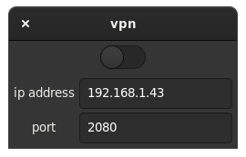

## VPN
This converts proxy to vpn (by creating a tun network interface)
I made this program to help me connect from a vpn on my mobile to my laptop

## hierarchy
- mobile:
    - Openvpn
    - Every proxy (sock5 proxy)
- laptop:
    - this app

## Requirements
- badvpn
- nettools
- iproute
- killall
- gtk3

# Note:
- you must run this app as a sudoer user (use sudo or pkexec)
